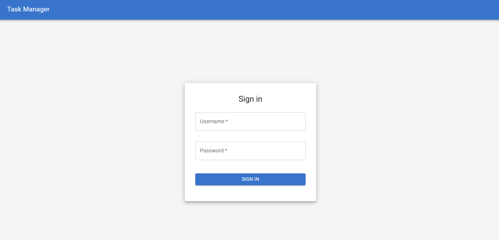
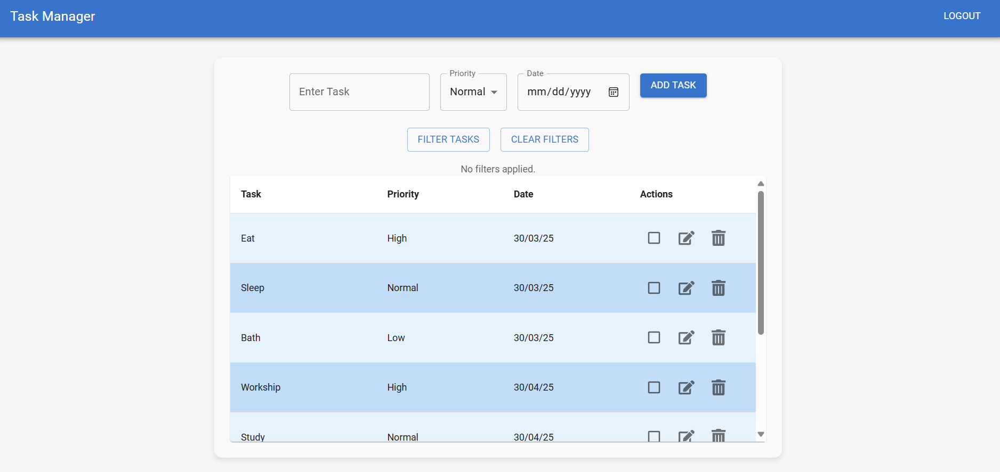
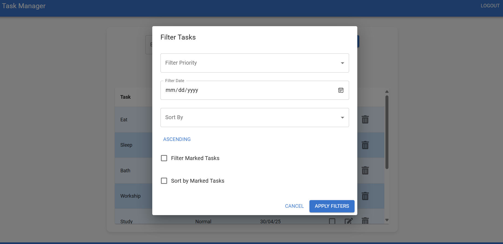

# Task Management Dashboard with Sign-In (Single Account)

This project is a React-based task management dashboard that allows a single user to create, filter, sort, and mark tasks. It includes a sign-in feature using a pre-configured account. It utilizes Redux for state management, Material-UI for a clean and responsive user interface.

## Features

* **Sign-In (Single Account):** Users can sign in using a pre-configured account (Username: `Ravi`, Password: `1234`).
* **Add Tasks:** Users can add tasks with text, priority (Low, Normal, High), and due date.
* **Filter Tasks:** Tasks can be filtered by priority, date, and marked status.
* **Sort Tasks:** Tasks can be sorted by priority, date, and marked status in ascending or descending order.
* **Mark Tasks:** Users can mark tasks for easy identification.
* **Edit Tasks:** Users can edit the text, priority, and date of existing tasks.
* **Delete Tasks:** Users can delete tasks.
* **Responsive Design:** The dashboard is designed to be responsive and work well on various screen sizes.
* **Redux State Management:** Global application state is managed using Redux.
* **Material-UI:** Provides a clean and consistent user interface.
* **React-Toastify:** Provides user friendly toast messages for task updates.
## Example Usage with Images:

And here is a screenshot of the login screen:



Here is a screenshot of the dashboard:



Here is a screenshot of the filter:




## Technologies Used

* React
* Redux
* Material-UI (@mui/material, @mui/icons-material)
* React-Toastify
* React Icons

## Installation

1.  **Clone the repository:**

    ```bash
    git clone https://github.com/ravi0629prakash/Task-manager.git
    ```

2.  **Navigate to the project directory:**

    ```bash
    cd Task-manager
    ```

3.  **Install dependencies:**

    ```bash
    npm install
    ```

## Usage

1.  **Start the development server:**

    ```bash
    npm run dev
    ```

2.  **Open the application in your browser:**

    Visit `http://localhost:3000` in your web browser.

3.  **Sign in:**

    Use the username `Ravi` and password `1234` to sign in.

4.  **Manage tasks:**

    Use the dashboard to add, filter, sort, mark, edit, and delete tasks.

